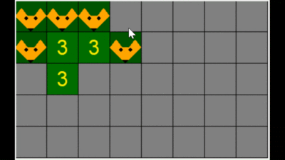

# Охота на лис

Небольшая игра. Главная цель - найти всех лис за минимальное количество ходов.

## Подробное описание

- В итоге должна получится игра
- random, tkinter, numpy

## Критерий завершенного проекта

Лисы ищутся, ничего не ломается и все выглядит более менее

## Команда проекта

- Короткова Юлия БКЛ-193
- Седловская Александра БКЛ-193

## Таймлайн проекта

- 24 февраля - выбор темы
- 2 марта - начало работы над проектом. Знакомство с библиотекой tkinter.
- 10 марта - начало изучения классов.
- 12 марта - написан код начального меню в классах с кнопками выхода и запуска игры. 16 добавлена кнопка счета
- 21 марта - закончена часть кода, ответственная за реализацию игры
- 22 марта - добавлены рекорды и настройка поля
- 27 марта - консультация. добавление кода, рисуюшего лис

## Распределение обязанностей в команде
Юля: создание окон, рисование лисы, добавление функции настройки поля 
Саша: написание кода игры

